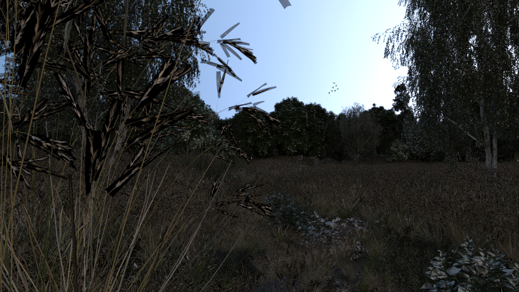

# PBRTParser

A parser written to convert pbrt scenes to yocto scenes (obj).



## How to use
Once compiled using cmake, run
```
parse <file_to_parse> <output_obj>
```

## TODO
In order of importance

- Environment maps don't work.
- Fix memory leaks using shared pointers.
- File paths: better handling.
- Checker texture produce different colors.
- Review materials
- Testures: implement mix textures.
- Test illumination, implement some hack for distant light.
- Uber material has index property that will use to create a constant texture for "eta" (seen in code)

## Rendering examples

You can find some rendering examples in the folder "images"

## Credits
This software is intended to work with and is built upon the yocto library, which is developed at the following repository: https://github.com/xelatihy/yocto-gl.
The yocto version used by this parser is https://github.com/xelatihy/yocto-gl/tree/1b0a001b82005485f83811728f7761c4f2a0d3a4