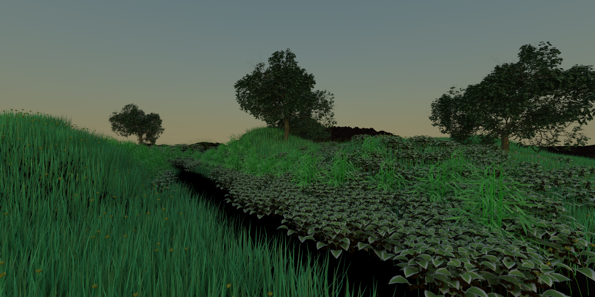

# PBRTParser

A parser written to convert pbrt scenes to yocto scenes (obj).



## How to use
Once compiled using cmake, run
```
parse <file_to_parse> <output_obj>
```

## TODO
In order of importance

- Mix material: texture blending might have some transparency problem (check landscape(view-0 as an example).
- Shapes can override current material's properties. Implement this.
- Checkerboard texture produce different colors.
- [pavilion-night] check the transparency issue of the left part of image, check why lights are much stronger than pbrt rendering.
- File paths (also textures file saving): better handling.
- Testures: implement mix textures.
- Test illumination, implement some hack for distant light.
- Fix memory leaks using shared pointers.
- Uber material has index property that will use to create a constant texture for "eta" (seen in code)

## Rendering examples

You can find some rendering examples in the folder "images"

## Credits
This software is intended to work with and is built upon the yocto library, which is developed at the following repository: https://github.com/xelatihy/yocto-gl.
The yocto version used by this parser is <a href="https://github.com/xelatihy/yocto-gl/tree/c06dd8014ca2de68911a16e744d4dd18c637a1bf">this</a>.